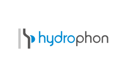
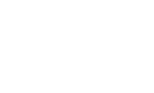
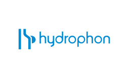
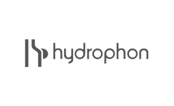
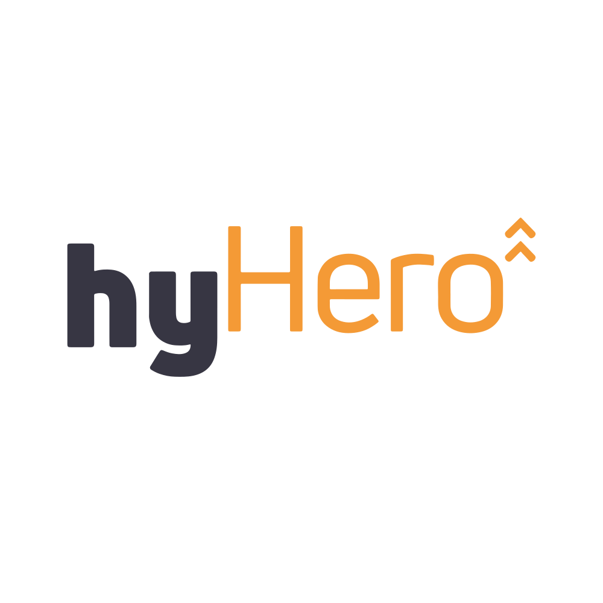

# Logo-Richtlinien

Dieses Dokument definiert die korrekte Verwendung aller Hydrophon-Logos und Produktlinien-Logos. Die Einhaltung dieser Richtlinien gewährleistet eine konsistente und professionelle Markenpräsenz über alle Touchpoints hinweg.

---

## 1. Hydrophon Hauptlogo

Das Hydrophon-Logo ist unser primäres Markenzeichen und muss korrekt und konsistent eingesetzt werden.

### Logo-Varianten

Wir bieten fünf Logo-Varianten für verschiedene Anwendungsfälle:

#### Original (Blau + Grau)


**Verwendung:** Standard-Variante für helle Hintergründe (Weiß, helles Grau). Dies ist die bevorzugte Variante für die meisten Anwendungen.

**Einsatzbereich:**
- Website-Header auf weißem Hintergrund
- Geschäftspapiere (Briefpapier, Visitenkarten)
- Produktverpackungen mit hellem Hintergrund
- Präsentationen auf weißen Folien

#### Weiß


**Verwendung:** Für dunkle Hintergründe oder farbige Hintergründe, bei denen maximaler Kontrast erforderlich ist.

**Einsatzbereich:**
- Website-Bereiche mit Hydrophon Blau (#1D50A0) Hintergrund
- Dunkle Hero-Bereiche
- Videoinhalte mit dunklem Hintergrund
- Social Media Posts mit farbigem Hintergrund

#### Schwarz


**Verwendung:** Einfarbiger Schwarzweiß-Druck, wenn keine Farbdruckoption verfügbar ist.

**Einsatzbereich:**
- Formulare und Verträge
- Faxvorlagen
- Schwarz-Weiß-Zeitungsanzeigen
- Stempel

#### Blau (Einfarbig)


**Verwendung:** Wenn nur die Markenfarbe Blau verfügbar ist (einfarbiger Druck, Prägung, Gravur).

**Einsatzbereich:**
- Einfarb-Druckverfahren
- Gravuren auf Produkten
- Stickereien
- Prägedruck

#### Grau (Einfarbig)


**Verwendung:** Subtile oder zurückhaltende Anwendungen, bei denen das Logo weniger dominant sein soll.

**Einsatzbereich:**
- Wasserzeichen in Dokumenten
- Hintergrundmuster
- Footer-Bereiche
- Technische Dokumentation

---

### Schutzraum (Clearspace)

Der Schutzraum ist der Mindestabstand, der das Logo von anderen grafischen Elementen, Texten oder Bildrändern trennen muss. Dies gewährleistet die Sichtbarkeit und Wirkung des Logos.

**Einheit:** Die Schutzraum-Einheit "X" entspricht der Höhe des Buchstabens "H" in "Hydrophon".

**Mindest-Schutzraum:** 1X auf allen Seiten (oben, unten, links, rechts)

```
┌─────────────────────────────────┐
│                                 │
│     X                           │
│   ┌───┐                         │
│   │   │    ┌───────────┐        │
│ X │ H │ X  │ HYDROPHON │  X     │
│   │   │    └───────────┘        │
│   └───┘                         │
│     X                           │
│                                 │
└─────────────────────────────────┘
```

**Erweiterte Schutzraum-Empfehlung:**
- Für hochsichtbare Platzierungen (Hauptheader, Hero-Bereiche, Plakate): 2X Schutzraum
- Für Bereiche mit visueller Komplexität (Fotos im Hintergrund): 2X Schutzraum

**Wichtig:** Der Schutzraum muss immer freigehalten werden. Keine anderen Elemente (Text, Bilder, Grafiken, Logos) dürfen in diesen Bereich eindringen.

---

### Mindestgrößen

Um die Lesbarkeit des Logos zu gewährleisten, müssen Mindestgrößen eingehalten werden:

#### Digital (Bildschirme, Web, Apps)
- **Mindestbreite:** 120px
- **Empfohlene Mindestbreite:** 150px für optimale Lesbarkeit

**Anwendung:**
- Website-Header: Minimum 150px, empfohlen 200-250px
- Mobile Header: Minimum 120px
- Social Media Profilbilder: Minimum 180px
- E-Mail-Signaturen: Minimum 120px

#### Print (Druckmaterialien)
- **Mindestbreite:** 30mm
- **Empfohlene Mindestbreite:** 40mm für optimale Lesbarkeit

**Anwendung:**
- Visitenkarten: Minimum 30mm, empfohlen 35-40mm
- Briefpapier: Minimum 40mm
- Broschüren: Minimum 30mm
- Plakate/Banner: Nach Proportionen skalieren

#### Favicon (Browser-Tabs, App-Icons)
Für sehr kleine Darstellungen verwenden Sie die speziellen Favicon-Dateien:
- 16x16px: `favicon-16x16.png`
- 32x32px: `favicon-32x32.png`
- 48x48px: `favicon-48x48.png`
- 192x192px: `android-chrome-192x192.png`
- 512x512px: `android-chrome-512x512.png`

Diese Dateien befinden sich im Ordner: `assets/logo/hydrophon/favicon/`

**Wichtig:** Bei Breiten unter 120px (digital) bzw. 30mm (print) ist die Lesbarkeit stark eingeschränkt. Erwägen Sie in solchen Fällen, nur das Logo-Symbol (H-Icon) ohne Schriftzug zu verwenden, falls verfügbar.

---

### Platzierung

#### Bevorzugte Positionen

**Website/Digital:**
- **Header:** Oben links, horizontal zentriert zum Container-Beginn
- **Hero-Bereiche:** Zentriert, mit großzügigem Schutzraum
- **Footer:** Links ausgerichtet oder zentriert
- **Sidebar:** Oben, linksbündig

**Print:**
- **Briefpapier:** Oben links, 20-25mm vom oberen Rand, 20-25mm vom linken Rand
- **Visitenkarten:** Vorne zentriert oder oben links
- **Broschüren:** Erste Seite oben links oder zentriert
- **Flyer:** Oben zentriert oder oben links

#### Ausrichtungsregeln

- **Horizontale Ausrichtung:** Das Logo sollte mit anderen wichtigen Elementen (Navigation, Hauptinhalt) visuell ausgerichtet sein
- **Vertikale Ausrichtung:** Bei horizontaler Anordnung mit Text sollte das Logo vertikal mittig zum Text ausgerichtet werden
- **Abstand zu Seitenrändern:** Minimum 20px (digital) bzw. 15mm (print)

---

### Hintergründe

#### Genehmigte Hintergründe

Das Logo funktioniert am besten auf folgenden Hintergründen:

**Weiß und helle Farben:**
- Weiß (#FFFFFF)
- Hellgrau (#F5F5F5, #EEEEEE)
- Sehr helle Farbtöne (Pastellfarben mit hoher Helligkeit)
- **Logo-Variante:** Original (Blau + Grau)

**Hydrophon Blau:**
- Hydrophon Blau (#1D50A0)
- Dunkle Blautöne
- **Logo-Variante:** Weiß

**Dunkle Farben:**
- Dunkelgrau (#333333, #222222)
- Schwarz (#000000)
- Dunkle Farbtöne
- **Logo-Variante:** Weiß

#### Kontrast-Anforderungen

**Minimaler Kontrast:** 4.5:1 (WCAG AA Standard)
**Empfohlener Kontrast:** 7:1 (WCAG AAA Standard)

**Testen Sie den Kontrast:** Verwenden Sie Tools wie den WebAIM Contrast Checker, um sicherzustellen, dass das Logo ausreichend Kontrast zum Hintergrund hat.

#### Foto- und Bildhintergründe

Wenn das Logo auf Fotos oder komplexen Bildhintergründen platziert wird:

**Anforderungen:**
1. **Vermeiden Sie visuell unruhige Bereiche** - Platzieren Sie das Logo auf ruhigen, einfarbigen Bereichen des Bildes
2. **Nutzen Sie Overlay-Techniken** - Fügen Sie einen halbtransparenten weißen oder dunklen Overlay hinzu, um den Kontrast zu verbessern
3. **Erweitern Sie den Schutzraum** - Verwenden Sie mindestens 2X Schutzraum bei Foto-Hintergründen
4. **Wählen Sie die richtige Variante** - Weiße Variante für dunkle Fotos, Original für helle Fotos

**Empfehlung:** Vermeiden Sie nach Möglichkeit die Platzierung des Logos direkt auf Fotos. Nutzen Sie stattdessen einfarbige Bereiche oder Overlay-Boxen.

---

### Fehlverwendung (Don'ts)

Die folgenden Verwendungen sind nicht gestattet und beschädigen die Markenintegrität:

#### 1. Nicht stauchen oder strecken
❌ **Falsch:** Das Logo darf nicht horizontal oder vertikal verzerrt werden.
- Dies verändert die Proportionen und macht das Logo unprofessionell
- Verwenden Sie immer proportionales Skalieren (Seitenverhältnis beibehalten)

#### 2. Nicht rotieren
❌ **Falsch:** Das Logo darf nicht gedreht oder schräg gestellt werden.
- Das Logo muss immer horizontal ausgerichtet sein
- Keine Rotation um irgendeine Achse

#### 3. Keine Schlagschatten oder Effekte
❌ **Falsch:** Keine Schlagschatten, Leuchteffekte, 3D-Effekte oder ähnliche grafische Effekte.
- Das Logo ist bereits für optimale Wirkung gestaltet
- Effekte reduzieren die Professionalität und Klarheit

#### 4. Nicht auf kontrastarmen Hintergründen platzieren
❌ **Falsch:** Das Logo darf nicht auf Hintergründen mit unzureichendem Kontrast platziert werden.
- Blaues Logo nicht auf blauem Hintergrund
- Graues Logo nicht auf grauem Hintergrund
- Immer mindestens 4.5:1 Kontrast sicherstellen

#### 5. Nicht beschneiden
❌ **Falsch:** Keine Teile des Logos dürfen abgeschnitten oder beschnitten werden.
- Das vollständige Logo muss immer sichtbar sein
- Auch der Schutzraum darf nicht beschnitten werden

#### 6. Farben nicht ändern
❌ **Falsch:** Die Logo-Farben dürfen nicht geändert werden.
- Verwenden Sie nur die bereitgestellten Varianten
- Keine individuellen Farbkombinationen erstellen
- Keine Transparenz-Reduktion (außer für Wasserzeichen mit spezifischer Genehmigung)

#### 7. Keine Effekte hinzufügen
❌ **Falsch:** Keine Verläufe, Konturen, Muster oder Texturen auf das Logo anwenden.
- Das Logo ist bereits final gestaltet
- Zusätzliche Effekte verfälschen die Markenidentität

#### 8. Nicht zu nah an anderen Elementen
❌ **Falsch:** Das Logo darf nicht zu nah an anderen grafischen Elementen, Texten oder Logos platziert werden.
- Halten Sie immer den Mindest-Schutzraum ein (1X)
- Bei komplexen Layouts verwenden Sie erweiterten Schutzraum (2X)

#### Weitere Verbote:
- Kein Nachzeichnen oder Nachbauen des Logos
- Keine Kombination mit anderen Logos ohne Genehmigung (siehe Co-Branding-Regeln)
- Keine Verwendung alter oder veralteter Logo-Versionen
- Keine individuellen Interpretationen oder Variationen

**Bei Unsicherheit:** Wenden Sie sich an die Marketingabteilung für Klärung.

---

## 2. Produktlinien-Logos

Hydrophon umfasst mehrere Produktlinien, jede mit eigenem Logo, das konsistent mit der Hauptmarke verwendet werden muss.

### Gluy


**Verfügbare Varianten:**
- **Original:** Gelbe und blaue Elemente auf transparentem Hintergrund
- **Weiß:** Für dunkle Hintergründe
- **Schwarz:** Für Schwarz-Weiß-Druck
- **Hellblau:** Einfarbige Anwendung in Hellblau
- **Dunkelblau:** Einfarbige Anwendung in Dunkelblau

**Primäre Farbkontexte:**
- Gelb: #FFEEB6 (Gluy Primärfarbe)
- Hellblau: #88A9C3 (Gluy Sekundärfarbe)

**Anwendungsbereiche:**
- Gluy-Produktverpackungen
- Gluy-Produktseiten auf der Website
- Gluy-spezifische Marketingmaterialien
- Social Media Posts zu Gluy-Produkten

**Schutzraum und Mindestgrößen:**
- Es gelten die gleichen Regeln wie für das Hydrophon-Hauptlogo
- Mindest-Schutzraum: 1X (basierend auf der Höhe des "G")
- Mindestbreite digital: 120px
- Mindestbreite print: 30mm

**Dateipfade:**
- SVG: `assets/logo/gluy/svg/logo-gluy-[variante].svg`
- PNG 2x: `assets/logo/gluy/png/logo-gluy-[variante]@2x.png`
- PNG 3x: `assets/logo/gluy/png/logo-gluy-[variante]@3x.png`

---

### hyHero



**Verfügbare Varianten:**
- **Original:** Orange und Grau auf transparentem Hintergrund
- **Weiß:** Für dunkle Hintergründe
- **Schwarz:** Für Schwarz-Weiß-Druck

**Primäre Farbkontexte:**
- Orange: #F49A36 (hyHero Primärfarbe)

**Anwendungsbereiche:**
- hyHero-Produktverpackungen
- hyHero-Produktseiten auf der Website
- hyHero-spezifische Marketingmaterialien
- Social Media Posts zu hyHero-Produkten
- Technische Dokumentation für hyHero-Produkte

**Schutzraum und Mindestgrößen:**
- Es gelten die gleichen Regeln wie für das Hydrophon-Hauptlogo
- Mindest-Schutzraum: 1X (basierend auf der Höhe des "h")
- Mindestbreite digital: 120px
- Mindestbreite print: 30mm

**Dateipfade:**
- SVG: `assets/logo/hyhero/svg/logo-hyhero-[variante].svg`
- PNG 2x: `assets/logo/hyhero/png/logo-hyhero-[variante]@2x.png`
- PNG 3x: `assets/logo/hyhero/png/logo-hyhero-[variante]@3x.png`

---

### hyIndustry


**Verfügbare Varianten:**
- **Original:** Dunkelblau und Grau auf transparentem Hintergrund
- **Weiß:** Für dunkle Hintergründe
- **Schwarz:** Für Schwarz-Weiß-Druck

**Primäre Farbkontexte:**
- Dunkelblau: #0E2638 (hyIndustry Primärfarbe)

**Anwendungsbereiche:**
- hyIndustry-Produktverpackungen
- hyIndustry-Produktseiten auf der Website
- hyIndustry-spezifische Marketingmaterialien
- Social Media Posts zu hyIndustry-Produkten
- B2B-Industriedokumentation

**Schutzraum und Mindestgrößen:**
- Es gelten die gleichen Regeln wie für das Hydrophon-Hauptlogo
- Mindest-Schutzraum: 1X (basierend auf der Höhe des "h")
- Mindestbreite digital: 120px
- Mindestbreite print: 30mm

**Dateipfade:**
- SVG: `assets/logo/hyindustry/svg/logo-hyindustry-[variante].svg`
- PNG 2x: `assets/logo/hyindustry/png/logo-hyindustry-[variante]@2x.png`
- PNG 3x: `assets/logo/hyindustry/png/logo-hyindustry-[variante]@3x.png`

---

### Co-Branding: Hydrophon + Produktlinien-Logo

In bestimmten Situationen müssen das Hydrophon-Hauptlogo und ein Produktlinien-Logo gemeinsam verwendet werden.

#### Hierarchie-Regeln

**Hydrophon ist die Dachmarke:**
- Das Hydrophon-Logo ist immer primär
- Produktlinien-Logos sind sekundär und unterstützend

#### Anordnung

**Bevorzugte Anordnung: Horizontal**
```
┌──────────────┐     ┌─────────┐
│  HYDROPHON   │  +  │  GLUY   │
└──────────────┘     └─────────┘
```

- Hydrophon-Logo links, Produktlinien-Logo rechts
- Trennzeichen in der Mitte (optional): Linie oder kein Trennzeichen
- Vertikale Zentrierung beider Logos

**Alternative Anordnung: Vertikal**
```
┌──────────────┐
│  HYDROPHON   │
└──────────────┘
       ↓
┌─────────────┐
│    GLUY     │
└─────────────┘
```

- Hydrophon-Logo oben, Produktlinien-Logo unten
- Horizontal zentriert
- Abstand: Mindestens 0.5X

#### Größenverhältnis

**Hydrophon-Logo:** 100% Größe (Referenz)
**Produktlinien-Logo:** 60-80% der Breite des Hydrophon-Logos

**Beispiel:**
- Hydrophon-Logo: 200px breit
- Gluy-Logo: 120-160px breit

#### Abstand zwischen Logos

**Mindestabstand:** 1X (basierend auf der Schutzraum-Einheit des Hydrophon-Logos)
**Empfohlener Abstand:** 1.5X

#### Anwendungsbeispiele

**Wann Co-Branding verwenden:**
- Produktlinien-spezifische Landingpages (Header)
- Messe-Displays für spezifische Produktlinien
- Produktverpackungen, die zur gesamten Hydrophon-Familie gehören
- Broschüren, die mehrere Produktlinien abdecken

**Wann nur Produktlinien-Logo verwenden:**
- Produktspezifische Detailseiten (ohne Hydrophon-Hauptlogo)
- Social Media Posts, die nur ein Produkt bewerben
- Produktetiketten mit begrenztem Platz

**Wann nur Hydrophon-Logo verwenden:**
- Unternehmensweite Kommunikation
- Hauptwebsite-Header
- Allgemeine Geschäftspapiere
- Imagekampagnen

#### Fehlverwendung bei Co-Branding

❌ **Falsch:** Produktlinien-Logo größer als Hydrophon-Logo
❌ **Falsch:** Zu geringer Abstand zwischen den Logos
❌ **Falsch:** Logos auf unterschiedlichen Baselines (nicht vertikal ausgerichtet)
❌ **Falsch:** Verwendung unterschiedlicher Varianten (z.B. Original + Schwarz)

---

## 3. Dateiformate

### SVG (Scalable Vector Graphics)

**Verwendung:** Web, digitale Anwendungen, skalierbare Grafiken

**Vorteile:**
- Verlustfreie Skalierung auf jede Größe
- Kleine Dateigröße
- Perfekte Schärfe auf allen Bildschirmen (inkl. Retina)
- Editierbar in Vektorgrafikprogrammen

**Wann verwenden:**
- Website-Header und -Footer
- Web-Applikationen
- Responsive Designs
- Icons und UI-Elemente
- Moderne E-Mail-Clients (mit Fallback)

**Pfad:** `assets/logo/[produktlinie]/svg/logo-[produktlinie]-[variante].svg`

**Hinweis:** SVG ist das bevorzugte Format für alle digitalen Anwendungen, wenn möglich.

---

### PNG (Portable Network Graphics)

**Verwendung:** Raster-Web-Grafiken, Retina-Displays, E-Mail, Social Media

**Vorteile:**
- Transparenter Hintergrund
- Breite Kompatibilität
- Optimiert für verschiedene Bildschirmauflösungen

**Verfügbare Auflösungen:**
- **@2x:** Für Standard-Retina-Displays (2x Pixeldichte)
- **@3x:** Für High-Resolution-Displays (3x Pixeldichte, z.B. iPhone)

**Wann verwenden:**
- E-Mail-Signaturen
- PowerPoint/Keynote-Präsentationen (wenn SVG nicht unterstützt wird)
- Social Media Posts und Profilbilder
- Legacy-Systeme ohne SVG-Support
- Raster-Bildbearbeitungsprogramme (Photoshop, etc.)

**Pfad:** `assets/logo/[produktlinie]/png/logo-[produktlinie]-[variante]@[2x|3x].png`

**Empfehlung:** Verwenden Sie @2x als Standard für moderne Webanwendungen. @3x für High-End-Mobile-Anwendungen.

---

### PDF (Portable Document Format)

**Verwendung:** Druckproduktion, professioneller Druck

**Hinweis:** PDF-Dateien für Druckzwecke sind in einem separaten Assets-Ordner verfügbar und unterscheiden sich je nach Farbraum:
- **PDF-RGB:** Für Digitaldruck und Screen-Anwendungen
- **PDF-CMYK:** Für professionellen Offset-Druck

**Wann verwenden:**
- Druckereien (Visitenkarten, Broschüren, Flyer)
- Hochwertige Printproduktionen
- Verpackungsdesign
- Großformatdruck (Banner, Plakate)

**Pfad:** Diese Dateien befinden sich im Original-Assets-Verzeichnis außerhalb des Design-Systems und werden bei Bedarf von der Marketingabteilung bereitgestellt.

---

### Favicon-spezifische Formate

Für Browser-Favicons und App-Icons werden spezielle vorbereitete PNG-Dateien verwendet:

**Verfügbare Größen:**
- **16x16:** Klassisches Browser-Favicon
- **32x32:** Standard-Favicon für moderne Browser
- **48x48:** Chrome-Adressleiste
- **192x192:** Android Chrome App-Icon
- **512x512:** Progressive Web App (PWA) Icon

**Zusätzliche Dateien:**
- `apple-touch-icon.png` - Optimiert für iOS Home-Screen
- `site.webmanifest` - Web App Manifest für PWA
- `favicon-einbindung.html` - HTML-Snippet für korrekte Einbindung

**Pfad:** `assets/logo/hydrophon/favicon/`

**Einbindung im HTML:**
```html
<link rel="icon" type="image/png" sizes="32x32" href="/assets/logo/hydrophon/favicon/favicon-32x32.png">
<link rel="icon" type="image/png" sizes="16x16" href="/assets/logo/hydrophon/favicon/favicon-16x16.png">
<link rel="apple-touch-icon" sizes="180x180" href="/assets/logo/hydrophon/favicon/apple-touch-icon.png">
<link rel="manifest" href="/assets/logo/hydrophon/favicon/site.webmanifest">
```

---

## 4. Download & Verwendung

### Dateinamenskonvention

Alle Logo-Dateien folgen dieser Namensstruktur:

```
logo-[produktlinie]-[variante].[dateierweiterung]
```

**Beispiele:**
- `logo-hydrophon-original.svg`
- `logo-gluy-weiss@2x.png`
- `logo-hyhero-schwarz.svg`
- `logo-hyindustry-original@3x.png`

**Produktlinien:**
- `hydrophon` - Hauptmarke
- `gluy` - Gluy-Produktlinie
- `hyhero` - hyHero-Produktlinie
- `hyindustry` - hyIndustry-Produktlinie

**Varianten:**
- `original` - Mehrfarbige Standardversion
- `weiss` - Weiße Einfarbversion
- `schwarz` - Schwarze Einfarbversion
- `blau` - Blaue Einfarbversion (nur Hydrophon)
- `grau` - Graue Einfarbversion (nur Hydrophon)
- `hellblau` - Hellblaue Einfarbversion (nur Gluy)
- `dunkelblau` - Dunkelblaue Einfarbversion (nur Gluy)

---

### Asset-Ordner-Struktur

Die Logos sind im Repository wie folgt organisiert:

```
design-system/
└── assets/
    └── logo/
        ├── hydrophon/
        │   ├── svg/
        │   │   ├── logo-hydrophon-original.svg
        │   │   ├── logo-hydrophon-weiss.svg
        │   │   ├── logo-hydrophon-schwarz.svg
        │   │   ├── logo-hydrophon-blau.svg
        │   │   └── logo-hydrophon-grau.svg
        │   ├── png/
        │   │   ├── logo-hydrophon-original@2x.png
        │   │   ├── logo-hydrophon-original@3x.png
        │   │   └── ... (alle Varianten)
        │   └── favicon/
        │       ├── favicon-16x16.png
        │       ├── favicon-32x32.png
        │       └── ... (alle Favicon-Dateien)
        ├── gluy/
        │   ├── svg/
        │   └── png/
        ├── hyhero/
        │   ├── svg/
        │   └── png/
        └── hyindustry/
            ├── svg/
            └── png/
```

---

### Verwendung in verschiedenen Kontexten

#### Webentwicklung
- Verwenden Sie **SVG** für beste Qualität und Performance
- Nutzen Sie **PNG @2x** als Fallback für ältere Browser
- Implementieren Sie `<picture>`-Element für optimale Browser-Unterstützung

**Beispiel:**
```html
<picture>
  <source srcset="/assets/logo/hydrophon/svg/logo-hydrophon-original.svg" type="image/svg+xml">
  
</picture>
```

#### Design-Tools (Figma, Sketch, Adobe XD)
- Importieren Sie **SVG**-Dateien direkt
- Behalten Sie Vektorformat bei für flexible Skalierung

#### Präsentationen (PowerPoint, Keynote, Google Slides)
- Verwenden Sie **PNG @2x** für beste Darstellung
- Für Druckpräsentationen: Exportieren Sie zu PDF und verwenden Sie SVG

#### E-Mail-Marketing
- Verwenden Sie **PNG @2x** (beste Kompatibilität)
- Optimieren Sie Dateigröße für schnelles Laden
- Fügen Sie immer Alt-Text hinzu

#### Social Media
- **Facebook/LinkedIn:** PNG @2x, mindestens 180x180px
- **Instagram:** PNG @3x, quadratisches Format für Profilbild
- **Twitter:** PNG @2x, 400x400px empfohlen

#### Druck
- Kontaktieren Sie die Marketingabteilung für **PDF-CMYK-Dateien**
- Diese sind optimiert für professionellen Offsetdruck

---

### Kontakt für Fragen und individuelle Anfragen

**Marketingabteilung:**
- Für Logo-Dateien in speziellen Formaten (z.B. EPS, AI)
- Für Anpassungen oder Sonderfälle
- Für Co-Branding mit externen Partnern
- Für Print-PDF-Dateien (RGB/CMYK)
- Bei Unsicherheiten zur korrekten Verwendung

**Design-Team:**
- Für technische Fragen zur Integration
- Für Design-Feedback und Best Practices
- Für Entwicklung neuer Anwendungsfälle

---

## Zusammenfassung der wichtigsten Regeln

1. **Verwenden Sie immer die bereitgestellten offiziellen Logo-Dateien** - Bauen Sie das Logo nicht nach
2. **Halten Sie den Mindest-Schutzraum von 1X ein** - Das Logo braucht Raum zum Atmen
3. **Respektieren Sie die Mindestgrößen** - 120px (digital) / 30mm (print)
4. **Wählen Sie die richtige Variante** für den Hintergrund - Original für hell, Weiß für dunkel
5. **Stauchen, strecken oder rotieren Sie das Logo nicht** - Proportionen sind heilig
6. **Fügen Sie keine Effekte hinzu** - Das Logo ist bereits perfekt gestaltet
7. **Stellen Sie ausreichend Kontrast sicher** - Mindestens 4.5:1
8. **Bei Co-Branding: Hydrophon ist immer primär** - Produktlinien-Logos sind sekundär

**Bei Fragen oder Unsicherheiten wenden Sie sich immer an die Marketingabteilung.**

---

**Version:** 1.0
**Letzte Aktualisierung:** 2026-01-28
**Verantwortlich:** Hydrophon Marketing
